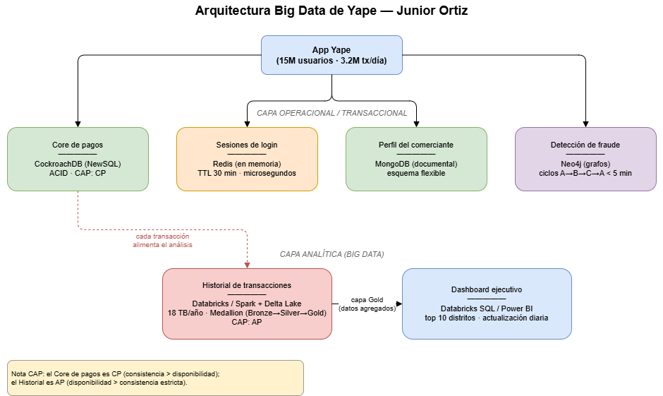
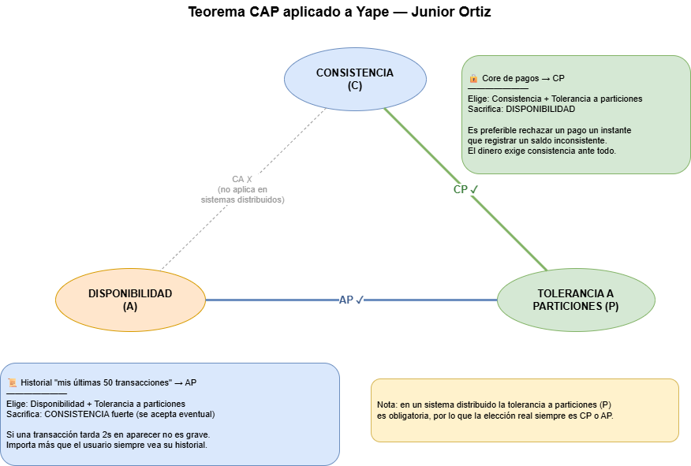

# PARTE A — DISEÑO Y ARQUITECTURA
### Examen Parcial Big Data (DD283) — Caso Yape
**Estudiante:** ORTIZ ANDRADE JUNIOR EMERZON

> *Asistencia de IA: se usó Claude (Anthropic) para explorar opciones tecnológicas. Las justificaciones fueron adaptadas al caso específico de Yape.*

---

## PREGUNTA 1.1 — Tabla de arquitectura Big Data de Yape

| Componente del sistema | Tecnología elegida | Tipo BD / Herramienta | Por qué esta tecnología para Yape |
|---|---|---|---|
| **Core de pagos** (3.2M tx/día, no puede perder dinero) | CockroachDB (NewSQL) | Base relacional distribuida con ACID | Garantiza transacciones ACID estrictas para que ningún saldo se duplique ni se pierda, y escala horizontalmente sin el cuello de botella de un solo servidor. |
| **Sesiones de login activo** (15M usuarios, expira 30 min) | Redis | Clave-valor en memoria (caché) | Lee y escribe en microsegundos y tiene expiración automática (TTL) nativa, ideal para cerrar la sesión sola a los 30 min con millones de usuarios concurrentes. |
| **Perfil del comerciante** (bodega, restaurante, taxi — atributos distintos) | MongoDB | NoSQL documental | Su esquema flexible permite que cada tipo de comercio tenga campos propios sin columnas vacías, tal como se demostró en la Parte C de este examen. |
| **Historial de transacciones para análisis** (18 TB/año) | Databricks / Apache Spark + Delta Lake | Lakehouse / procesamiento distribuido | El volumen masivo (18 TB/año) exige procesamiento distribuido y almacenamiento columnar económico (Parquet), con la arquitectura medallion implementada en la Parte B. |
| **Red de detección de fraude** (ciclo A→B→C→A en < 5 min) | Neo4j | Base de datos de grafos | Detectar ciclos y relaciones entre cuentas es nativo en un grafo; encontrar un patrón A→B→C→A en SQL exigiría joins costosísimos, en grafos es una sola consulta de camino. |
| **Dashboard ejecutivo** (top 10 distritos, actualización diaria) | Databricks SQL / Power BI sobre capa Gold | BI / almacén analítico columnar | Lee datos ya agregados (capa Gold) con actualización diaria, no en tiempo real, optimizado para consultas analíticas de solo lectura. |

---
### LINK DEL DIAGRAMA: https://drive.google.com/file/d/1F3sc5-VdSdwBRK5GsJSF8q94c2RTRnxf/view?usp=sharing

## PREGUNTA 1.2 — Teorema CAP

| Componente | Combinación CAP | Propiedad sacrificada | ¿Por qué ese sacrificio es correcto para este caso? |
|---|---|---|---|
| **Core de pagos** (débito/crédito de saldos) | **CP** (Consistencia + Tolerancia a particiones) | Disponibilidad (Availability) | **Correcto.** En pagos jamás se puede permitir un saldo inconsistente (dinero duplicado o perdido). Ante una falla de red es preferible rechazar o esperar la operación —perder disponibilidad un instante— antes que registrar un saldo incorrecto. El dinero exige consistencia por encima de todo. |
| **Historial "mis últimas 50 transacciones"** | **AP** (Disponibilidad + Tolerancia a particiones) | Consistencia fuerte (se acepta consistencia eventual) | **Correcto.** El historial es solo lectura/visualización. Si una transacción de hace 2 segundos tarda un poco en aparecer no es grave (consistencia eventual). Es más importante que el usuario siempre pueda ver su historial (disponibilidad) a que esté actualizado al milisegundo. |

> **Nota:** En un sistema distribuido la tolerancia a particiones (P) es obligatoria, por lo que la elección real siempre es entre CP y AP. La combinación CA solo aplicaría a un sistema de un único nodo, que no es el caso de Yape.

---

### LINK DEL DIAGRAMA: https://drive.google.com/file/d/1Y3lST_3SFW1rBGTnwAIv6-Tb_7Gd2hdV/view?usp=sharing

## PREGUNTA 1.3 — NewSQL (CockroachDB)

**a) ¿Qué limitación de Oracle resuelve CockroachDB al escalar de 15M a 50M usuarios?**

Oracle escala principalmente de forma **vertical** (un servidor cada vez más grande y caro), lo que choca con un techo físico y de costo de licencias. CockroachDB escala de forma **horizontal**: se agregan nodos y la base distribuye los datos automáticamente manteniendo SQL y ACID, así que crece de manera lineal sin el cuello de botella de un único servidor central.

**b) ¿Por qué MongoDB NO puede reemplazar a Oracle para el procesamiento de pagos aunque también escala horizontalmente?**

Porque MongoDB está diseñado priorizando disponibilidad y consistencia eventual, y su modelo no ofrece las garantías ACID estrictas con aislamiento serializable que un core financiero necesita. Un pago requiere atomicidad fuerte entre cuentas (debitar a uno y acreditar a otro como una sola operación indivisible); un sistema orientado a la disponibilidad eventual arriesga dejar saldos inconsistentes. Aunque MongoDB soporta transacciones multi-documento, su filosofía de consistencia no calza con la exigencia de un sistema de dinero.

**c) ¿Qué mecanismo técnico usa CockroachDB para mantener ACID en múltiples nodos distribuidos?**

**Raft** (protocolo de consenso). CockroachDB usa consenso Raft para replicar y acordar el estado entre nodos, y sobre él construye transacciones distribuidas que preservan ACID.
